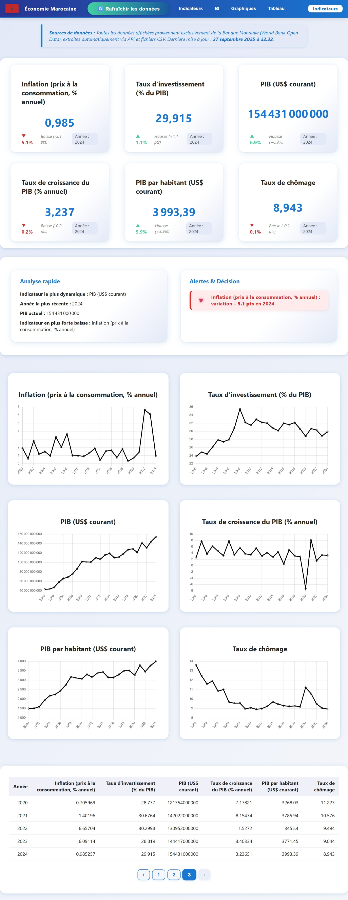

# Datawarehouse Économie Marocaine

Ce projet vise à construire un datawarehouse sur l’économie marocaine, avec une application web interactive permettant d’explorer et de visualiser des indicateurs économiques clés. Il met en œuvre des pratiques modernes de data engineering, développement backend et frontend, ainsi que de visualisation de données.

## Objectifs
- Centraliser et transformer des données économiques publiques sur le Maroc
- Mettre en place un ETL complet (Extract, Transform, Load)
- Concevoir un schéma en étoile pour l’analyse multidimensionnelle
- Développer une API et une interface web pour l’exploration des données

## Fonctionnalités principales
- Extraction et transformation automatisée de données économiques
- Stockage structuré dans un datawarehouse (schéma en étoile)
- API REST pour l’accès aux indicateurs
- Dashboard interactif avec graphiques et tableaux
- Visualisation des tendances et comparaisons sur plusieurs années

## Technologies utilisées
- Python (ETL, API)
- SQL (schéma en étoile)
- JavaScript, HTML, CSS (frontend)
- Chart.js (visualisation)

## Structure du projet
```
main.py
api/
  server.py
etl/
  extract.py
  transform.py
  load.py
  config.py
data/
  ... (fichiers CSV et métadonnées)
star_schema/
  create_schema.sql
frontend/
  ... (dashboard, composants, styles)
```

## Installation & Exécution
1. Cloner le dépôt :
   ```powershell
   git clone https://github.com/Bayron98/datawarehouse-economie-marocaine.git
   ```
2. Installer les dépendances Python :
   ```powershell
   pip install -r requirements.txt
   ```
3. Lancer l’ETL :
  > Ouvrez un terminal à la racine du projet et exécutez :
  ```powershell
  python main.py
  ```

4. Lancer l’API (séparément) :
  > Ouvrez un second terminal à la racine du projet et exécutez :
  ```powershell
  python api/server.py
  ```
  Le serveur expose l'API (vérifiez le fichier `api/server.py` pour le port utilisé, généralement 5000 ou 8000).

5. Démarrer le frontend :
  ```powershell
  cd frontend
  npm install
  npm start
  ```

## Screenshots


## Auteur
**Bayron98** 